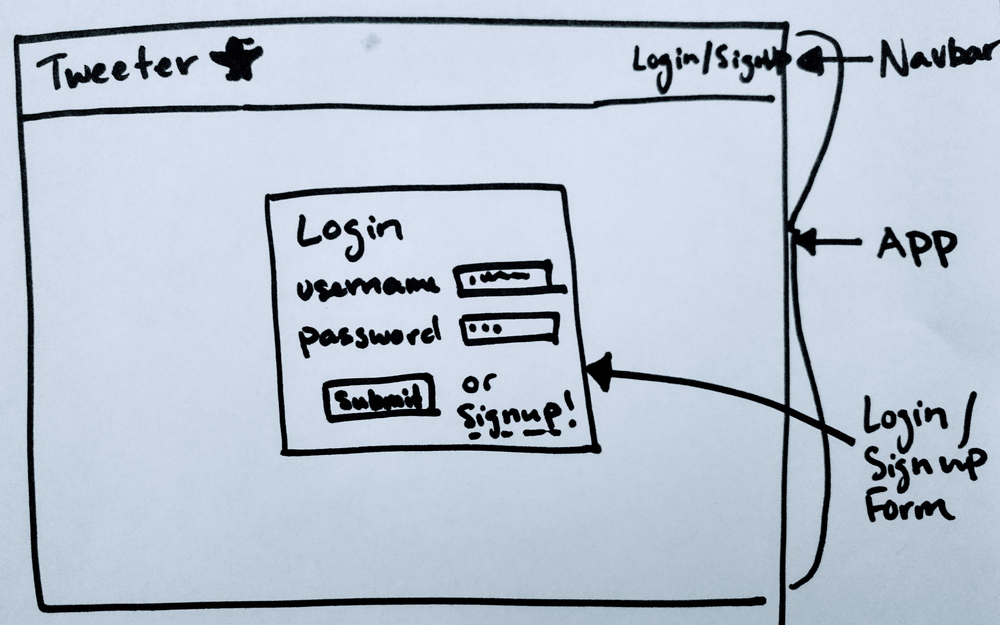
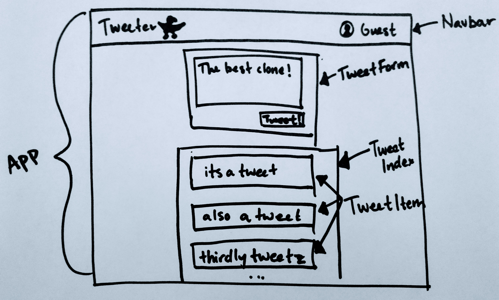
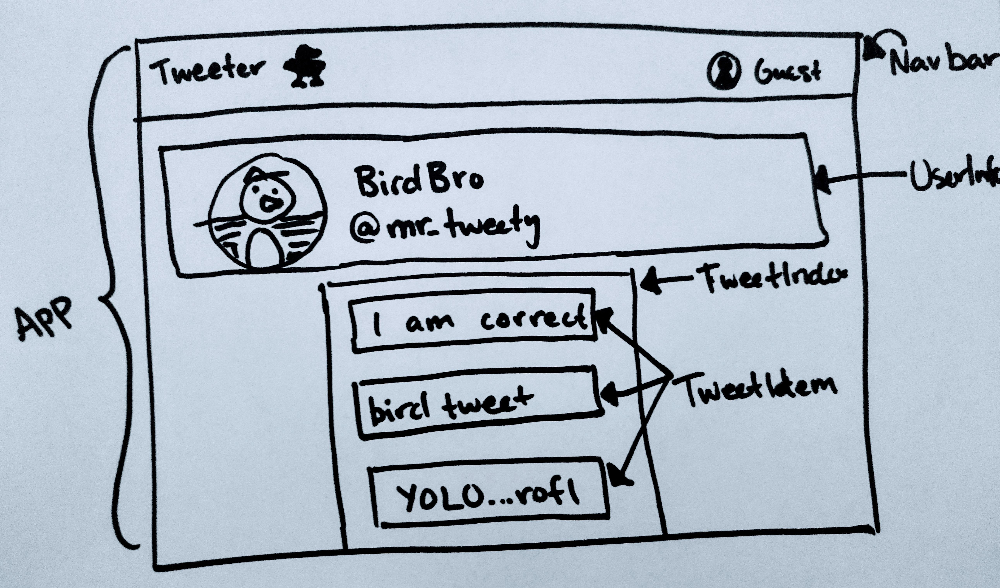
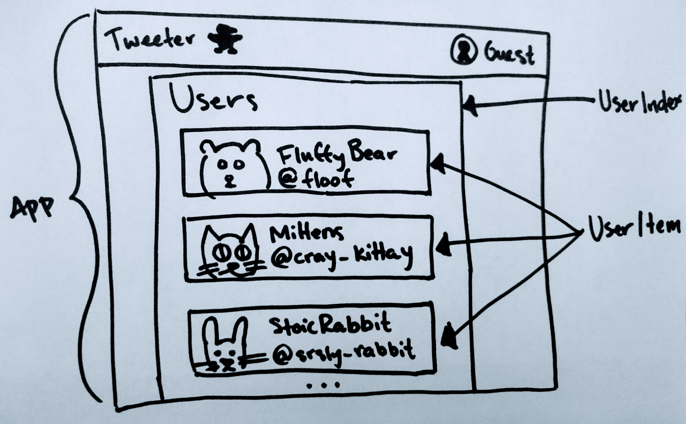

# Full-stack Proposal Preparation: Component Hierarchy

Now that we are React+Redux wizards, we should turn our gaze to the future, to our full-stack projects!

Take some time to research the site you are cloning. While referring to to your [MVPs][mvps], keep these things in mind:
- What views are required?
- How can these views be broken down into React components? Think boxes-in-boxes.
- Which components can be reused in different components?
- What data does each component need from our redux state?
  - Does it need to `connect` to the store or can it be passed down from a parent as `props`?

[mvps]: ../../proposal/mvp-list.md

Create a rough-draft of your component hierarchy (starting from `App`) which includes a list of the needed components (per view) in a hierarchy with the data source for each component. While not required, we also recommend laying out your component hierarchy visually (using wireframes).

## Example

Here's an example for a _super_ basic Twitter clone (with wireframes):

---
# Tweeeter Component hierarchy

## Views

### Login/Signup

* App
  * Navbar - `connect`s to `session`
  * Login/signup form - `connect`s to `errors`

### Home

* App
  * Navbar - `connect`s to `session`
  * TweetForm - `connect`s to `errors`
  * TweetIndex - `connect`s to `tweets`
    * TweetItem - receives `tweet` as `prop` from parent component

### User

* App
  * Navbar - `connect`s to `session`
  * UserInfo - `connect`s to `users`
  * TweetIndex - `connect`s to `tweets`
    * TweetItem - received `tweet` from parent component

### Users

* App
  * Navbar - `connect`s to `session`
  * UserIndex - `connect`s to `users`
    * UserItem - receives `user` as `prop` from parent component
